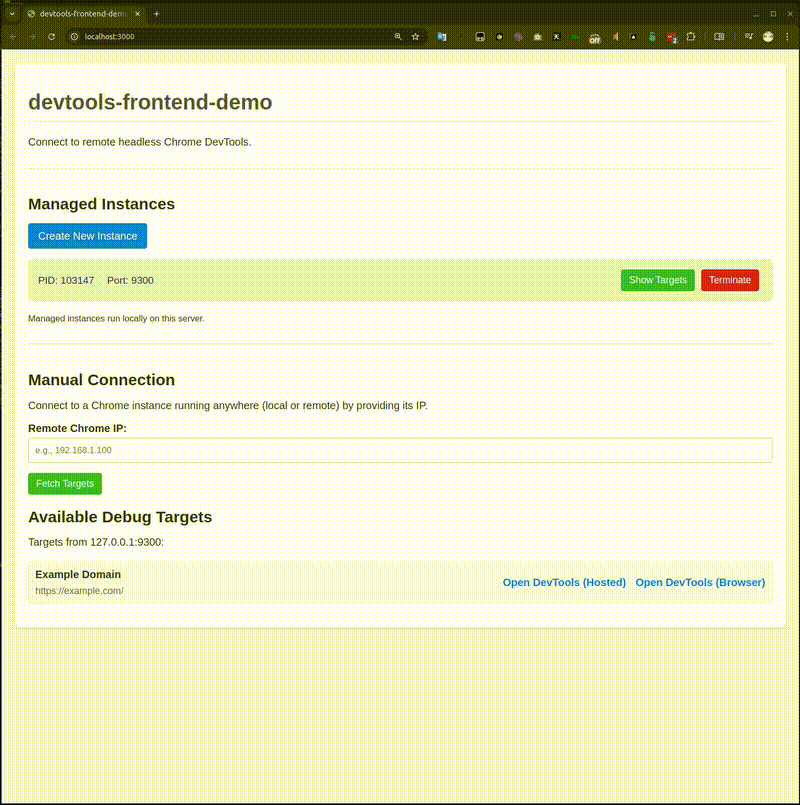

# Chrome DevTools マネージャー：技術的実装とコアライブラリ

*2025年3月31日*

## デモンストレーション：Chrome DevTools マネージャーの動作

Chrome DevTools マネージャーの実際の動作をより良く説明するために、アプリケーションの主要機能を示すスクリーンキャストデモを作成しました：



このスクリーンキャストでは以下を実演しています：

1. **インスタンス管理** - ヘッドレスChromeインスタンスの作成と管理
2. **ターゲット検出** - Chromeインスタンスからデバッグ可能なターゲットの取得と表示
3. **DevTools接続** - ローカルにホストされたDevToolsフロントエンドとブラウザ内蔵のDevToolsの両方を使用したターゲットへの接続
4. **リアルタイム操作** - インスタンス作成からデバッグまでのシームレスなワークフロー

この視覚的なデモンストレーションは、この記事で説明されている概念を明確にし、実際のシナリオにおけるChrome DevTools Protocolの実用的な応用を示しています。

## プロジェクト概要

Chrome DevTools マネージャーは、ローカルで実行されているヘッドレスChromeインスタンスを管理し、それらのDevToolsに接続するためのWebインターフェースです。この記事では、使用されているコアライブラリ、Chrome Remote Debugging Protocolの応用、WebSocket通信メカニズムなど、プロジェクトの技術的実装の詳細について掘り下げます。

## コア技術スタック

このプロジェクトでは、以下のコア技術とライブラリを使用しています：

1. **Node.js/Express**: バックエンドサーバー用
2. **バニラJavaScript**: フレームワークに依存しないフロントエンド実装
3. **Chrome DevTools Protocol (CDP)**: Chromeインスタンスと通信するためのコアプロトコル
4. **chrome-devtools-frontend-build**: ローカルにホストされたDevToolsフロントエンド
5. **WebSocket**: DevToolsとChromeインスタンス間のリアルタイム通信を可能にする

それぞれの技術コンポーネントを詳細に分析しましょう。

## バックエンド実装：Node.jsとExpress

### サーバーセットアップ

このアプリケーションは、APIエンドポイントを提供し、静的ファイルを配信するためにExpressフレームワークを使用しています：

```javascript
const express = require('express');
const http = require('http');
const path = require('path');
const { spawn } = require('child_process');
const findFreePort = require('find-free-port');

const app = express();
const port = 3000; // Webインターフェース用のポート

// 静的ファイルの配信
app.use(express.static(path.join(__dirname, 'public')));

// Chrome DevTools フロントエンドの静的ファイルを配信
try {
    const devtoolsFrontendPath = path.join(__dirname, 'node_modules', 'chrome-devtools-frontend-build', 'build');
    console.log(`DevToolsフロントエンドの配信元: ${devtoolsFrontendPath}`);
    app.use('/devtools', express.static(devtoolsFrontendPath));
} catch (error) {
    console.error("chrome-devtools-frontend-buildの静的パス設定エラー:", error);
}
```

### Chromeインスタンス管理

アプリケーションはNode.jsの`child_process`モジュールを使用してChromeインスタンスを管理しています。各Chromeインスタンスは、リモートデバッグを有効にするための特定のコマンドライン引数で起動されます：

```javascript
// アクティブなChromeインスタンスを保存
const chromeInstances = {};

// 新しいChromeインスタンスを作成するエンドポイント
app.post('/instances', async (req, res) => {
    try {
        // Chromeインスタンス用の空きポートを見つける
        const [freePort] = await findFreePort(9222, 9300);
        
        // Chrome実行ファイルのパス（システムに合わせて調整）
        const chromePath = '/usr/bin/google-chrome';
        
        // Chrome用のコマンドライン引数
        const args = [
            `--remote-debugging-port=${freePort}`,
            '--disable-gpu',
            '--headless=new',
            '--no-first-run',
            '--no-default-browser-check'
        ];
        
        // 新しいChromeプロセスを起動
        const chromeProcess = spawn(chromePath, args, {
            detached: true,
            stdio: 'ignore',
        });
        
        // プロセスIDとポートを保存
        const pid = chromeProcess.pid;
        chromeInstances[pid] = {
            port: freePort,
            process: chromeProcess
        };
        
        // プロセスIDとポートを返す
        res.json({ pid, port: freePort });
        
    } catch (error) {
        console.error('Chromeインスタンス作成エラー:', error);
        res.status(500).json({ error: 'Chromeインスタンスの作成に失敗しました' });
    }
});
```

### ターゲット検出

アプリケーションはChromeインスタンスからデバッグターゲットを取得するためのエンドポイントを提供しています：

```javascript
// Chromeインスタンスからターゲットを取得するエンドポイント
app.get('/targets', async (req, res) => {
    try {
        const { ip, port } = req.query;
        
        if (!ip || !port) {
            return res.status(400).json({ error: 'IPとポートが必要です' });
        }
        
        // ChromeのデバッグAPIからターゲットを取得
        const url = `http://${ip}:${port}/json`;
        const response = await fetch(url);
        
        if (!response.ok) {
            throw new Error(`ターゲットの取得に失敗しました: ${response.statusText}`);
        }
        
        const targets = await response.json();
        res.json(targets);
        
    } catch (error) {
        console.error('ターゲット取得エラー:', error);
        res.status(500).json({ error: 'ターゲットの取得に失敗しました', details: error.message });
    }
});
```

## フロントエンド実装：バニラJavaScript

フロントエンドはバニラJavaScriptで構築されており、シンプルさとパフォーマンスに重点を置いています。Chromeインスタンスを管理し、DevToolsに接続するためのユーザーインターフェースを提供します。

### イベントリスナーとUI操作

```javascript
document.addEventListener('DOMContentLoaded', () => {
    const createInstanceBtn = document.getElementById('create-instance');
    const instancesList = document.getElementById('instances-list');
    const ipInput = document.getElementById('ip-input');
    const portInput = document.getElementById('port-input');
    const fetchTargetsBtn = document.getElementById('fetch-targets');
    const targetsList = document.getElementById('targets-list');
    
    // デフォルトIPをlocalhostに設定
    ipInput.value = 'localhost';
    
    // 新しいChromeインスタンスを作成するためのイベントリスナー
    createInstanceBtn.addEventListener('click', createChromeInstance);
    
    // ターゲットを取得するためのイベントリスナー
    fetchTargetsBtn.addEventListener('click', fetchTargets);
    
    // 新しいChromeインスタンスを作成する関数
    async function createChromeInstance() {
        try {
            const response = await fetch('/instances', { method: 'POST' });
            const data = await response.json();
            
            if (response.ok) {
                // 新しいインスタンス用のリストアイテムを作成
                const listItem = document.createElement('li');
                listItem.innerHTML = `
                    <div>
                        <strong>PID:</strong> ${data.pid} | 
                        <strong>Port:</strong> ${data.port}
                    </div>
                    <div class="instance-actions">
                        <button class="fetch-btn" data-port="${data.port}">ターゲット取得</button>
                        <button class="terminate-btn" data-pid="${data.pid}">終了</button>
                    </div>
                `;
                
                // ボタンにイベントリスナーを追加
                const fetchBtn = listItem.querySelector('.fetch-btn');
                fetchBtn.addEventListener('click', () => {
                    portInput.value = fetchBtn.dataset.port;
                    fetchTargets();
                });
                
                const terminateBtn = listItem.querySelector('.terminate-btn');
                terminateBtn.addEventListener('click', () => terminateInstance(data.pid));
                
                // リストアイテムをインスタンスリストに追加
                instancesList.appendChild(listItem);
            } else {
                throw new Error(data.error || 'Chromeインスタンスの作成に失敗しました');
            }
            
        } catch (error) {
            console.error('エラー:', error);
            alert(`Chromeインスタンス作成エラー: ${error.message}`);
        }
    }
    
    // Chromeインスタンスからターゲットを取得する関数
    async function fetchTargets() {
        try {
            const ip = ipInput.value.trim();
            const port = portInput.value.trim();
            
            if (!ip || !port) {
                throw new Error('IPとポートが必要です');
            }
            
            // ターゲットリストをクリア
            targetsList.innerHTML = '';
            
            // ローディングインジケータを表示
            const loadingItem = document.createElement('li');
            loadingItem.textContent = 'ターゲットを読み込み中...';
            targetsList.appendChild(loadingItem);
            
            // サーバーからターゲットを取得
            const response = await fetch(`/targets?ip=${ip}&port=${port}`);
            const targets = await response.json();
            
            // ローディングインジケータを削除
            targetsList.removeChild(loadingItem);
            
            if (response.ok) {
                // ターゲットを表示
                if (targets.length === 0) {
                    const emptyItem = document.createElement('li');
                    emptyItem.textContent = 'ターゲットが見つかりませんでした';
                    targetsList.appendChild(emptyItem);
                } else {
                    targets.forEach(target => {
                        const listItem = document.createElement('li');
                        listItem.className = 'target-item';
                        
                        // ターゲット情報セクションを作成
                        const targetInfo = document.createElement('div');
                        targetInfo.className = 'target-info';
                        targetInfo.innerHTML = `
                            <div><strong>タイトル:</strong> ${target.title}</div>
                            <div><strong>タイプ:</strong> ${target.type}</div>
                            <div><strong>URL:</strong> ${target.url}</div>
                        `;
                        
                        // ターゲットアクションセクションを作成
                        const targetActions = document.createElement('div');
                        targetActions.className = 'target-actions';
                        
                        // DevToolsリンクが利用可能な場合は追加
                        if (target.devtoolsFrontendUrl) {
                            // Chrome内蔵DevToolsへのリンク
                            const chromeDevToolsUrl = target.devtoolsFrontendUrl.replace(
                                /^\/devtools/, 
                                `http://${ip}:${port}/devtools`
                            );
                            
                            // ローカルにホストされたDevToolsへのリンク
                            const localDevToolsUrl = target.devtoolsFrontendUrl.replace(
                                /^\/devtools/, 
                                `/devtools`
                            );
                            
                            // 両方のDevToolsオプション用のボタンを追加
                            targetActions.innerHTML = `
                                <a href="${chromeDevToolsUrl}" target="_blank" class="devtools-btn">
                                    Chrome DevTools
                                </a>
                                <a href="${localDevToolsUrl}" target="_blank" class="devtools-btn">
                                    ローカルDevTools
                                </a>
                            `;
                        }
                        
                        // セクションをリストアイテムに追加
                        listItem.appendChild(targetInfo);
                        listItem.appendChild(targetActions);
                        
                        // リストアイテムをターゲットリストに追加
                        targetsList.appendChild(listItem);
                    });
                }
            } else {
                throw new Error(targets.error || 'ターゲットの取得に失敗しました');
            }
            
        } catch (error) {
            console.error('エラー:', error);
            
            // エラーメッセージを表示
            targetsList.innerHTML = '';
            const errorItem = document.createElement('li');
            errorItem.className = 'error-item';
            errorItem.textContent = `エラー: ${error.message}`;
            targetsList.appendChild(errorItem);
        }
    }
    
    // Chromeインスタンスを終了する関数
    async function terminateInstance(pid) {
        try {
            const response = await fetch(`/instances/${pid}`, { method: 'DELETE' });
            
            if (response.ok) {
                // リストからインスタンスを削除
                const instanceItem = instancesList.querySelector(`[data-pid="${pid}"]`).parentNode.parentNode;
                instancesList.removeChild(instanceItem);
            } else {
                const data = await response.json();
                throw new Error(data.error || 'Chromeインスタンスの終了に失敗しました');
            }
            
        } catch (error) {
            console.error('エラー:', error);
            alert(`Chromeインスタンス終了エラー: ${error.message}`);
        }
    }
});
```

## Chrome DevTools Protocolの統合

Chrome DevTools Protocol (CDP)はこのプロジェクトの中核であり、Chromeインスタンスとの通信を可能にします。CDPはブラウザの自動化、デバッグ、プロファイリングを可能にするメソッドとイベントのセットを提供します。

### WebSocket通信

DevToolsフロントエンドはWebSocket接続を介してChromeインスタンスと通信します。ユーザーがDevToolsリンクをクリックすると、フロントエンドはChromeインスタンスへのWebSocket接続を確立し、CDPコマンドの送信を開始します。

```javascript
// DevToolsフロントエンドでのWebSocket接続の例
const ws = new WebSocket(webSocketUrl);

ws.onopen = () => {
    console.log('WebSocket接続が確立されました');
    
    // DOMを取得するCDPコマンドを送信
    ws.send(JSON.stringify({
        id: 1,
        method: 'DOM.getDocument',
        params: {}
    }));
};

ws.onmessage = (event) => {
    const message = JSON.parse(event.data);
    console.log('メッセージを受信:', message);
    
    // レスポンスを処理
    if (message.id === 1) {
        // DOMドキュメントを処理
    }
};

ws.onerror = (error) => {
    console.error('WebSocketエラー:', error);
};

ws.onclose = () => {
    console.log('WebSocket接続が閉じられました');
};
```

## Chrome Remote Debugging Protocolの詳細

### CDPとは

Chrome Remote Debugging Protocol (CDP)は、ChromeまたはChromiumベースのブラウザとプログラム的に対話できる強力なインターフェースです。ブラウザの内部機能を公開し、開発者は以下のことが可能になります：

- DOMの検査と操作
- パフォーマンスのプロファイリング
- JavaScriptのデバッグ
- ネットワークアクティビティの監視
- ブラウザナビゲーションの制御
- スクリーンショットの取得など

このプロトコルはChrome DevToolsのような開発ツールの基盤ですが、その真の力はWebSocket接続を介してアクセスできることにあり、自動化やテストシナリオに最適です。

### CDPのアーキテクチャ

CDPの核心はクライアント-サーバーモデルに従っています：

1. **サーバー**：リモートデバッグが有効になっているChromeインスタンス（通常はポート9222で実行）
2. **クライアント**：WebSocketを介してChromeに接続し、コマンドを送信してイベントを受信するアプリケーション

Chromeがリモートデバッグを有効にして実行されると、いくつかのHTTPエンドポイントが公開されます：

- `/json` - 利用可能なすべてのデバッグターゲット（タブ、拡張機能など）をリスト表示
- `/json/version` - バージョンとWebSocket情報を提供
- `/json/protocol` - プロトコル定義を返す
- `/devtools/inspector.html` - DevToolsフロントエンドUI

自動化において最も重要な部分は、各ターゲットに対して公開されるWebSocketエンドポイントであり、クライアントとブラウザ間の双方向通信を可能にします。

### WebSocket通信：ヘッドレスChromeへの橋渡し

#### なぜWebSocketなのか？

WebSocketはクライアントとサーバー間の永続的な全二重通信チャネルを提供します。リクエスト-レスポンスパターンに従うHTTPリクエストとは異なり、WebSocketは以下を可能にします：

- リアルタイムデータ交換
- 低レイテンシー通信
- イベント駆動型アーキテクチャ
- ポーリングと比較して低いオーバーヘッド

Chromeのデバッグプロトコルにとって、WebSocketは完璧な転送メカニズムです。なぜなら、WebSocketは継続的なポーリングを必要とせずに、ブラウザイベント（DOMの変更、コンソールログ、ネットワークリクエストなど）の即時通知を可能にするからです。

#### CDPでのWebSocket通信の仕組み

ChromeのデバッグプロトコルとのWebSocket通信がどのように確立されるかを見てみましょう：

1. **ディスカバリー**：まず、クライアントが`/json`エンドポイントに問い合わせて、利用可能なターゲットを検出します：

```javascript
// Chrome DevTools マネージャーのserver.jsから
app.get('/targets', (req, res) => {
    const ip = req.query.ip;
    const targetPort = req.query.port || 9222;
    
    const url = `http://${ip}:${targetPort}/json`;
    
    http.get(url, (response) => {
        let data = '';
        response.on('data', (chunk) => {
            data += chunk;
        });
        
        response.on('end', () => {
            try {
                const targets = JSON.parse(data);
                res.json(targets);
            } catch (e) {
                res.status(500).json({ error: 'JSONレスポンスの解析に失敗しました' });
            }
        });
    });
});
```

2. **接続**：ターゲットが選択されると、ターゲット情報で提供される`webSocketDebuggerUrl`へのWebSocket接続が確立されます：

```javascript
// Chrome DevTools マネージャーのscript.jsから
function displayTargets(targets, remoteIp, remotePort) {
    targets.forEach(target => {
        if (target.type === 'page') {
            // ターゲットからWebSocketパスを抽出
            let wsPath = '';
            if (target.webSocketDebuggerUrl) {
                wsPath = target.webSocketDebuggerUrl.substring(
                    target.webSocketDebuggerUrl.indexOf('/', 5)
                );
            } else {
                wsPath = `/devtools/page/${target.id}`;
            }
            
            // WebSocket経由で接続するDevTools URLを生成
            const devtoolsUrl = `/devtools/inspector.html?ws=${hostPort}${wsPath}`;
            
            // DevToolsを開くリンクを作成
            listItem.innerHTML = `
                <a href="${encodeURI(devtoolsUrl)}" target="_blank">
                    DevToolsを開く（ホスト型）
                </a>
            `;
        }
    });
}
```

3. **通信**：接続後、クライアントはWebSocketを通じてコマンドを送信し、イベントを受信できます：

```javascript
// CDPとのWebSocket通信の例（Chrome DevTools マネージャーからではない）
const ws = new WebSocket('ws://localhost:9222/devtools/page/[target-id]');

ws.onopen = () => {
    // URLにナビゲートするコマンドを送信
    ws.send(JSON.stringify({
        id: 1,
        method: 'Page.navigate',
        params: { url: 'https://example.com' }
    }));
};

ws.onmessage = (event) => {
    const message = JSON.parse(event.data);
    console.log('メッセージを受信:', message);
    
    // レスポンスを処理
    if (message.id === 1) {
        // URLナビゲーションを処理
    }
};

ws.onerror = (error) => {
    console.error('WebSocketエラー:', error);
};

ws.onclose = () => {
    console.log('WebSocket接続が閉じられました');
};
```

### Webテストと自動化のためのCDPの活用

#### ヘッドレスChrome：完璧な自動化パートナー

ヘッドレスChromeは可視的なUIなしで実行され、自動テスト環境に最適です。Chrome DevTools マネージャーでは、リモートデバッグを有効にするための特定のフラグを付けてヘッドレスChromeインスタンスを起動します：

```javascript
// Chrome DevTools マネージャーのserver.jsから
const args = [
    '--headless',
    '--disable-gpu',
    '--no-sandbox',
    `--remote-debugging-port=${freePort}`,
    '--remote-debugging-address=0.0.0.0',
    `--user-data-dir=./chrome-data/instance-${freePort}`,
    '--remote-allow-origins=devtools://devtools,http://localhost:3000',
    'https://example.com'
];

const chromeProcess = spawn('google-chrome', args);
```

主要なフラグには以下が含まれます：
- `--headless`：UIなしでChromeを実行
- `--remote-debugging-port`：デバッグ接続をリッスンするポート
- `--remote-debugging-address=0.0.0.0`：任意のIPからの接続を許可
- `--remote-allow-origins`：WebSocket接続に許可されるオリジンを指定

#### 自動化のユースケース

##### 1. 自動テスト

CDPは強力な自動テストシナリオを可能にします：

- **ビジュアルリグレッションテスト**：変更前後のページのスクリーンショットを取得して視覚的な回帰を検出
- **エンドツーエンドテスト**：ユーザー操作を自動化し、アプリケーションの動作を検証
- **パフォーマンステスト**：読み込み時間、メモリ使用量、CPU消費などのパフォーマンスメトリクスを収集

##### 2. Webスクレイピングとデータ抽出

CDPは従来のスクレイピング方法に比べて以下の利点を提供します：

- **JavaScript実行**：JavaScriptによってレンダリングされたコンテンツにアクセス
- **認証処理**：ログインプロセスの自動化
- **ブラウザ状態管理**：Cookieとセッション情報の維持

##### 3. サイト監視とパフォーマンス分析

- **実ユーザーメトリクス**：実際のユーザー体験に一致するパフォーマンスデータを収集
- **エラー監視**：JavaScriptエラーとコンソールメッセージをキャプチャ
- **ネットワーク分析**：API呼び出し、リソース読み込み、潜在的なボトルネックを監視

### 高度なCDPテクニック

#### プログラムによるCDPとの対話

Chrome DevTools マネージャーはDevToolsをChromeインスタンスに接続することに焦点を当てていますが、Puppeteer、Playwright、または直接WebSocketを介してプログラム的にCDPと対話することもできます：

```javascript
// 生のWebSocketを使用した例（Chrome DevTools マネージャーからではない）
const WebSocket = require('ws');

async function captureScreenshot(targetUrl) {
    // まず利用可能なターゲットを取得
    const response = await fetch('http://localhost:9222/json');
    const targets = await response.json();
    const target = targets.find(t => t.type === 'page');
    
    // WebSocket経由で接続
    const ws = new WebSocket(target.webSocketDebuggerUrl);
    
    return new Promise((resolve, reject) => {
        ws.on('open', () => {
            // URLにナビゲート
            ws.send(JSON.stringify({
                id: 1,
                method: 'Page.navigate',
                params: { url: targetUrl }
            }));
        });
        
        ws.on('message', (data) => {
            const message = JSON.parse(data);
            
            // ページの読み込みを待ってからスクリーンショットを撮影
            if (message.method === 'Page.loadEventFired') {
                ws.send(JSON.stringify({
                    id: 2,
                    method: 'Page.captureScreenshot'
                }));
            }
            
            // スクリーンショットデータを処理
            if (message.id === 2 && message.result) {
                resolve(message.result.data); // Base64エンコードされた画像
                ws.close();
            }
        });
        
        ws.on('error', reject);
    });
}
```

## DevToolsフロントエンド統合

このプロジェクトでは、ローカルにホストされたDevToolsフロントエンドを提供するために`chrome-devtools-frontend-build`パッケージを使用しています。これにより、ユーザーは以下のことが可能になります：

- 任意のブラウザからDevToolsにアクセスする
- `devtools://`プロトコル（Chrome/Chromiumブラウザでのみ動作）に依存せずにDevToolsを使用する
- `devtools://`プロトコルをサポートしていないブラウザでDevToolsを使用する

## セキュリティに関する考慮事項

CDPを使用する際、特に本番環境では、以下のセキュリティプラクティスを考慮してください：

1. **ネットワーク分離**: ファイアウォールを使用してデバッグポートへのアクセスを制限する
2. **オリジン制限**: `--remote-allow-origins`を使用して接続可能なオリジンを制限する
3. **ユーザーデータの分離**: インスタンスごとに別の`--user-data-dir`を使用する
4. **サンドボックス**: サンドボックスの無効化（`--no-sandbox`）には注意する

## 結論

Chrome DevTools マネージャープロジェクトは、Node.js、Express、バニラJavaScriptを使用して強力なChromeインスタンス管理ツールを構築する方法を示しています。Chrome DevTools ProtocolとWebSocket通信を通じて、ヘッドレスChromeインスタンスを管理し接続するための柔軟な方法を提供します。

主な技術的ハイライトには以下が含まれます：

1. `child_process`を使用したChromeプロセスの管理
2. `find-free-port`によるポートの自動割り当て
3. Chromeのリモートデバッグ APIを活用したデバッグターゲットの取得
4. DevToolsとChrome間のWebSocket通信の実装
5. ローカルにホストされたDevToolsフロントエンドを提供するための`chrome-devtools-frontend-build`の統合

これらの技術の組み合わせにより、このChrome DevTools マネージャーはWeb開発、テスト、デバッグシナリオに適した強力なツールとなっています。

## 参考文献

1. [Chrome DevTools Protocol ドキュメント](https://chromedevtools.github.io/devtools-protocol/)
2. [Node.js ドキュメント](https://nodejs.org/en/docs/)
3. [Express.js ドキュメント](https://expressjs.com/)
4. [WebSocket API](https://developer.mozilla.org/en-US/docs/Web/API/WebSockets_API)
5. [Chromeコマンドラインスイッチ](https://peter.sh/experiments/chromium-command-line-switches/)
